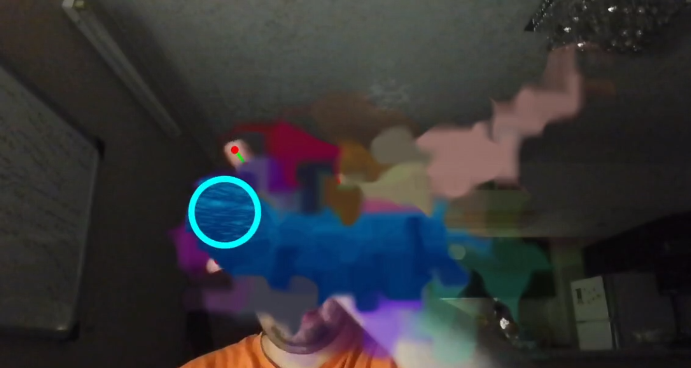
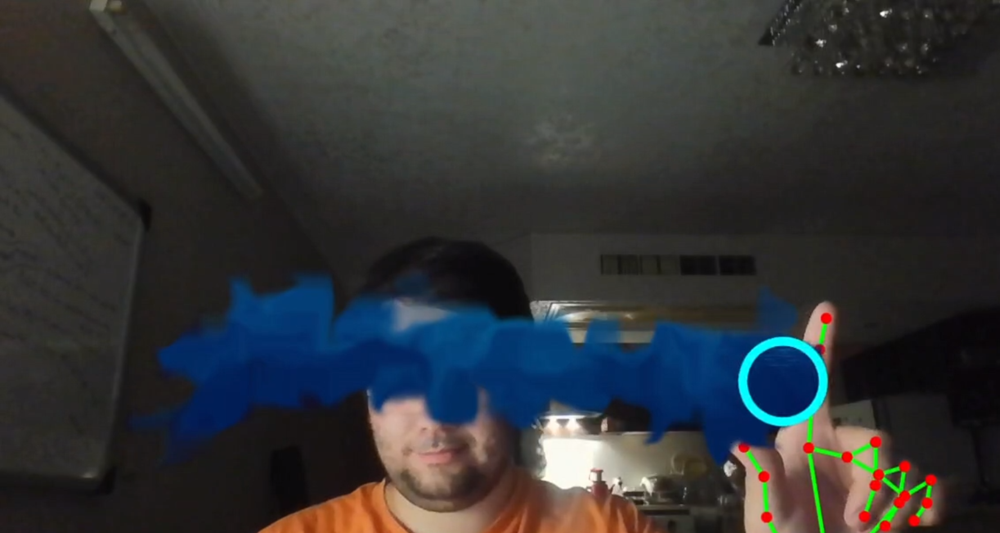
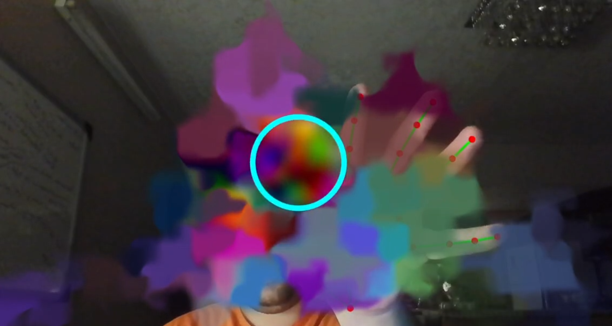
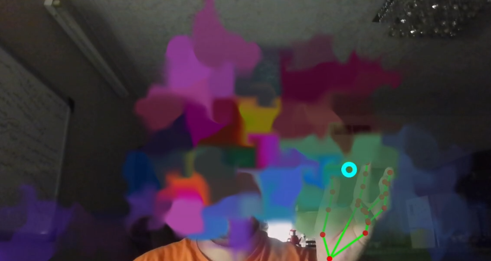
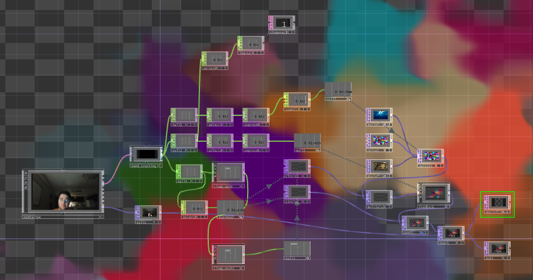

# Multimedia-Systems
Multimedia Systems, Exercises and Projects

## Courses Info
- Teacher : Dr. Behrouz Shahrokh Zade
- Score : 20 / 20
- Semester : 8

#### Project Workbench

  
  
  
  

## Project Images
#### TouchDesigner (Video is Available [Here](./Assets/1.mp4))

  

